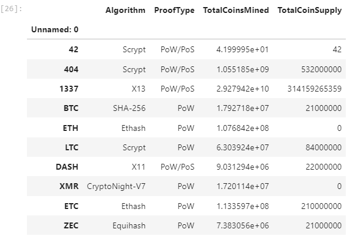
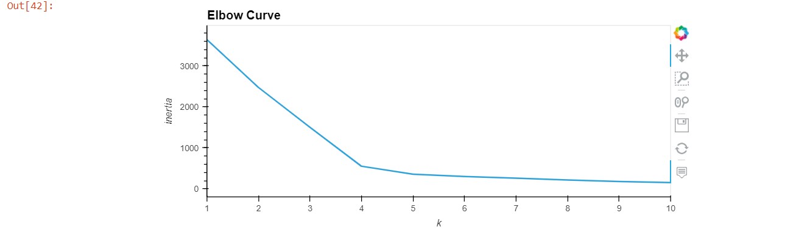
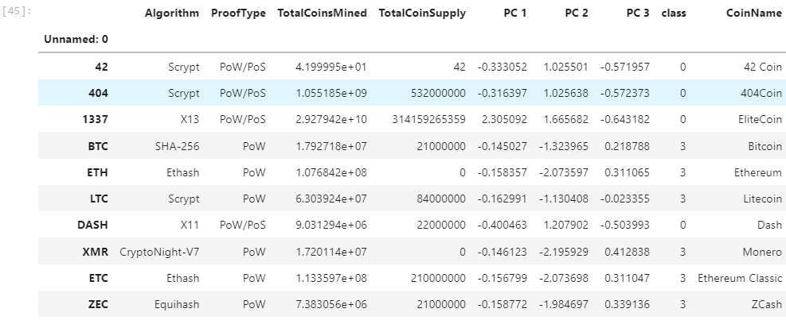
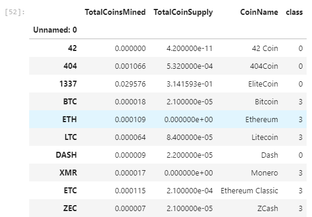
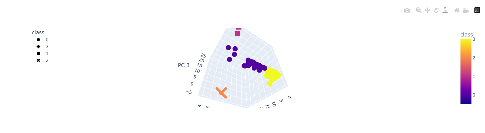
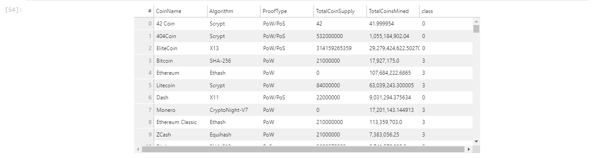

# Cryptocurrency Analysis
Accountability Accounting, a prominent investment bank, is interested in offering a new cryptocurrency investment portfolio for its customers. The company, however, is lost in the vast universe of cryptocurrencies. A report has been created that includes what cryptocurrencies are on the trading market and how they could be grouped to create a classification system for this new investment.

## Data Source
https://min-api.cryptocompare.com/data/all/coinlist

## Deliverables
* Deliverable 1: Preprocessing the Data for PCA
    - Cleaned the data by dropping columns, removing null values and standardizing then created a new dataframe

    

* Deliverable 2: Reducing Data Dimensions Using PCA
    - Created new dataframe, pcs_df by using PCA algorithm

    

* Deliverable 3: Clustering Cryptocurrencies Using K-means
    - Created elbow curve usign hvPlot

    

    - New dataframe - clustered

    

* Deliverable 4: Visualizing Cryptocurrencies Results
    - Created new dataframe to plot and table

    

    - 3D Scatter Plot

    

    - Scatter Plot
    

    - Summarized Table

    